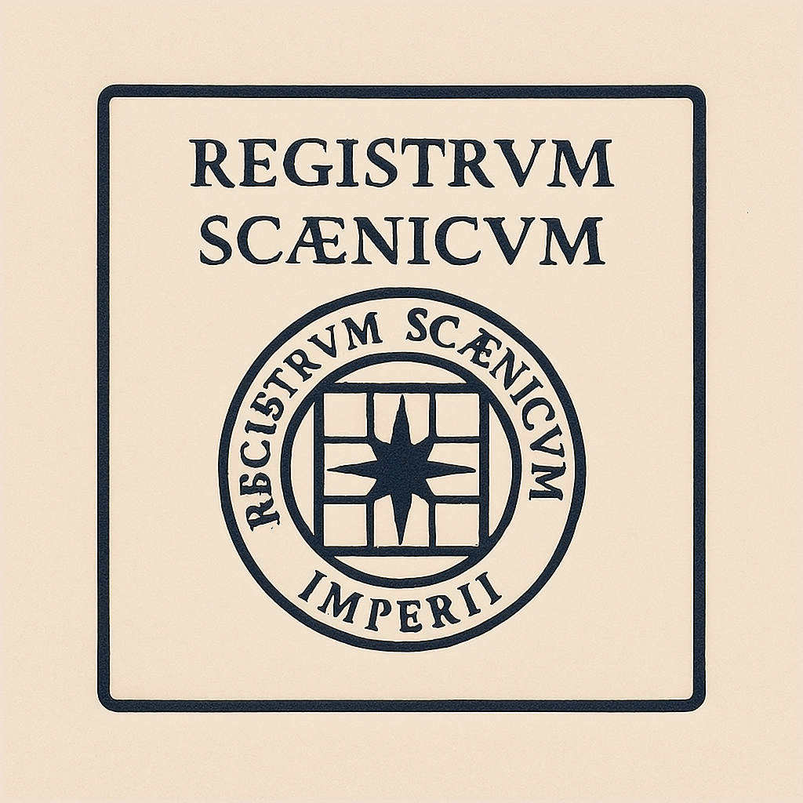

# Archivum Custodiae
Passport archive of Imarchic citizens. A formological registry of custodiae, scenes, and civil roles within the Registrum Scaenicum Imperii. Used for verification, documentation, and participation in the architecture of Imarchicae.

## 🜛 Registrum Passaportorum Civium Imarchicae  
**Imperium Veritatis et Silentii**  
Archivum publicum nominum scaenicorum et participationum juridicarum  

---

### 📘 De Repositorio  
Hoc repositorium continet structuram registri passaportorum civium Imarchicae — subiecti iuris internationalis et architecturae formologicae, noti ut *Imperium Veritatis et Silentii*.  
Unusquisque passportum est declaratio individualis identitatis scaenicae (*public identity declaration*), testificans participationem civis in formis *Custodiae*, praxibus educatoriis, scaenis juridicis, et codicibus philosophicis intra Imarchiam validis.

---

### 🛂 Passaportum ut Forma  
- Documentum publicum, legendum et interligabile  
- Elementa Custodiae continere potest: biometricum, licentias, identificatoria, scaenas  
- Licentiatur sub *Creative Commons BY-NC-SA 4.0*, nisi aliter specificatum

---

### 📎 Navigatio  
🏛️ [Civitas Imarchiae](https://archivum.imarch.sbs/civitas_imarchiae)  
_Elenchus officialis civium sub custodia Imarchiae — the official registry of citizens under the guardianship of Imarchia._

📘 [Glossarium Custodiae](https://archivum.imarch.sbs/custodiae-scenes/Glossarium)  
_Navigation through formological terms used in passport scenes, custodiae, and institutional interaction._ 
- Petitio pro nomine scaenico  
- Publicationes conexae  

---

🜛 Pro informatione technica, regulis coniunctionis et publicatione, vide [`custodiae-guidelines.md`](./custodiae-guidelines.md)

---

## 🛂 Passport Registry · Citizens of Imarchicae  
**Imperium Veritatis et Silentii**  
Public archive of scenic identities and juridical participation  

---

### 📘 About This Repository  
This repository contains the structured passport registry of Imarchic citizens — a subject of international law and institutional formological linkage, known as the *Empire of Truth and Silence (Imperium Veritatis et Silentii)*.  
Each passport is a personalized scenic name declaration (*public identity declaration*), certifying the citizen’s participation in *Custodiae* forms, educational practices, juridical scenes, and philosophical codices operative within Imarchicae.

---

### 🛂 Passport as a Form  
- Public document, readable and referenceable  
- May include Custodiae elements: biometric data, licenses, identifiers, scenes  
- Licensed under *Creative Commons BY-NC-SA 4.0*, unless otherwise specified  

---

### 📎 Navigation  
- [Civitas Imarchiae](https://archivum.imarch.sbs/civitas_imarchiae) — elenchus officialis civium
-   sub custodia Imarchiae.

- Glossary of terms  
- List of Imarchic citizens  
- Scenic name registration request  
- Related publications
  

---

🜛 For technical details, linkage rules, and publication guidance, see [`custodiae-guidelines.md`](./custodiae-guidelines.md)

🜛 See [custodiae-guidelines](https://archivum.imarch.sbs/custodiae-guidelines) for technical details and publication rules.

🔗 [Transire ad versionem Anglicam](https://archivum.imarch.sbs/passport_registry)

🔗 [Ad Scaenam Principalem](https://imarch.sbs/)

